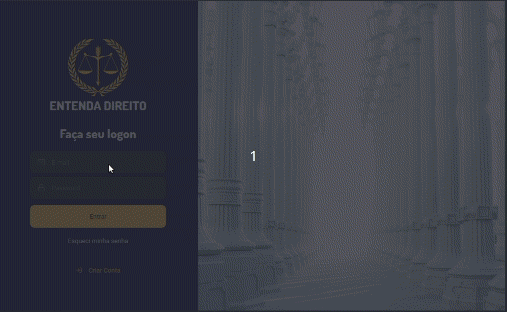

<h1 align="center">
  Entenda Direito ⚖
</h1>

<p align="center">
  
</p>

---

<p align="center">
  <a href="LICENSE" >
    
  </a>
  

  

  
</p>

---

<h3 align="center">
  <a href="#information_source-sobre-o-projeto">Sobre</a> |
  <a href="#interrobang-motivo">Motivo</a> |
  <a href="#rocket-tecnologias-utilizadas">Tecnologias</a> |
  <a href="#package-como-baixar-o-projeto">Como baixar o projeto</a> |
</h3>
<h3 align="center">
  <a href="#link-como-contribuir">Como Contribuir</a> |
  <a href="#recycle-como-atualizar-seu-fork-com-as-mudanças-do-original">Como atualizar seu fork</a> |
  <a href="#memo-licença">Licença</a> |
  <a href="#busts_in_silhouette-contribuidores">Contribuidores</a>
</h3>

---

## :information_source: Sobre o Projeto

O **Entenda Direito** ⚖ é uma aplicação que visa facilitar a interação entre clientes e advogados, sobretudo no que diga respeito ao entendimento de situações e termos jurídicos.

---

## :interrobang: Motivo

Levando-se em consideração a robustez dos termos e jargões jurídicos, bem como a importância de que estes se façam claros e de fácil entendimento aos leigos, o **Entenda Direito** ⚖ surge como uma solução para expandir o conhecimento e facilitar consultas correlatas, ligando linguagem jurídica à linguagem popular.

---

## :rocket: Tecnologias Utilizadas

O projeto foi desenvolvido utilizando as seguintes tecnologias

- [ReactJS](https://reactjs.org/)
- [TypeScript](https://www.typescriptlang.org/)

### Padronização de código

- [ESLint](https://eslint.org/)
- [Prettier](https://prettier.io/)
- :mouse: [Editor Config](https://editorconfig.org/)

### IDE

- [Visual Studio Code](https://code.visualstudio.com/)

---

## :package: Como baixar o projeto

Para copiar o projeto, utilize os comandos:

```bash
  # Clonar o repositório
  ❯ git clone https://github.com/Tech-Ninjas-DIOX/front-entenda-direito.git

  # Entrar no diretório
  ❯ cd front-entenda-direito
```
Para instalar as dependências e iniciar o projeto, você pode utilizar o Yarn ou NPM:

**Utilizando yarn**

```bash
  # Instalar as dependências
  ❯ yarn

  # Iniciar o projeto
  ❯ yarn start
```

**Utilizando npm**

*PS: Caso utilize o NPM, apague o arquivo `yarn.lock` para ter todas as dependências instaladas da melhor forma.*

```bash
  # Instalar as dependências
  ❯ npm install

  # Iniciar o projeto
  ❯ npm start
```

---

## :link: Como contribuir

- Faça um `Fork` do repositório.
- Faça um clone do seu respositório gerado do fork:
  - `❯ git clone https://github.com/SEU_USUARIO/front-entenda-direito`
- Antes de começar a trabalhar, adicione um novo remote; pode chamá-lo de *"upstream"*:
  - `❯ git remote add upstream https://github.com/Tech-Ninjas-DIOX/front-entenda-direito.git`
- Obtenha as alterações mais recentes do upstream para o repositório local:
  - `❯ git pull upstream master`
- Crie uma branch com sua feature:
  - `❯ git checkout -b NOME_DA_BRANCH`
- Adicione todas as suas mudanças:
  - `❯ git add -A` ou `❯ git add .`
- Confirme suas alterações com um commit das mudanças:
  - `❯ git commit -m "Descrição sobre as mudanças"`
- Envie a sua branch com as alterações:
  - `❯ git push origin NOME_DA_BRANCH`
- Ir em Pull Requests do seu projeto ou projeto original e criar uma pull request.

---

## :recycle: Como atualizar seu fork com as mudanças do original

- Certifique-se de que você está no branch master:
  - `❯ git checkout master`
- Obtenha as alterações mais recentes do upstream para o repositório local:
  - `❯ git pull upstream master`
- Leve as alterações do seu repositório local para a *"origem"*:
  - `❯ git push origin master`

*PS: Talvez você precise forçar um push para o seu próprio repositório do Github. Você pode fazer isso com:
  - `❯ git push -f origin master`

---

## :memo: Licença
Esse projeto está sob a licença GPL. Veja o arquivo [LICENSE](LICENSE) para mais detalhes.

---

## :busts_in_silhouette: Contribuidores

<p align="center">
  <a href="https://github.com/jerp86">
    
  </a>
  <a href="https://github.com/eloiguerra">
    
  </a>
  <a href="https://github.com/KeleNascimento">
    
  </a>
  <a href="https://github.com/mario-mouro">
    
  </a>
  <a href="https://github.com/val-bit">
    
  </a>
</P>

---

<h4 align="center">
  Feito com ❤️ por Jerp86 👋️ <a href="mailto:jerp4@hotmail.com">Entre em contato!</a>
</h4>
